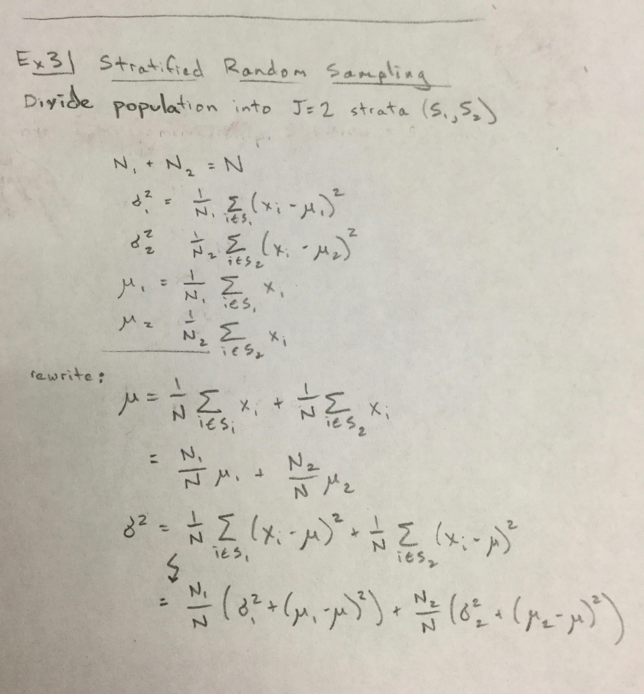
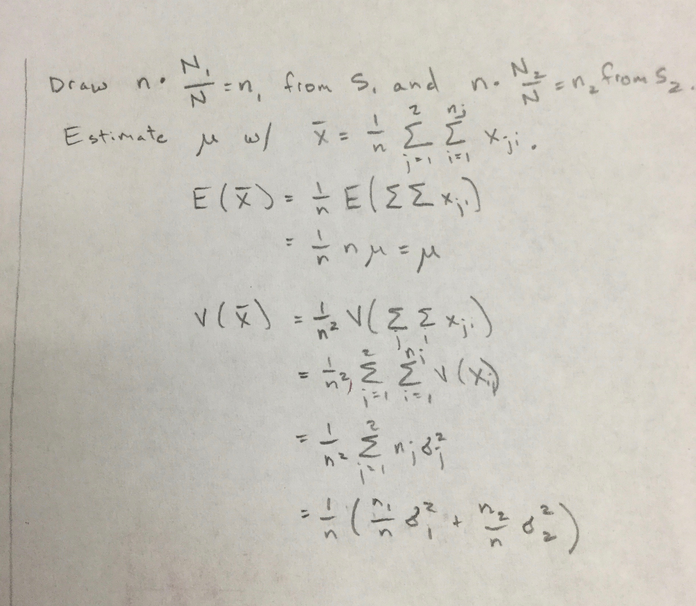

```{r, include=FALSE}
require(tidyverse) # load package
options(digits=4) # print 4 decimal places only
set.seed(1999) # set seed for reproducibility
```

### Exercises from the Book

7.1: 1 - 4


### Practice with LaTeX

Please transcribe the mathematics found below into LaTeX using the snippets of LaTeX available in the Slack thread. If you see errors or inconsistencies in my hand-written notes, please correct them.  We'll start class on Friday by discussing the link between the code shown in the slides and the analytical approach below.

```{r latex-a, echo=FALSE, out.width = '50%', fig.align="center"}

```

```{r latex-b, echo=FALSE, out.width = '50%', fig.align="center"}

```

\newpage

### Practice with R

Adapt the code from the slides to produce a single ggplot with two density curves on it: one with the density of 5000 $\bar{x}$s estimated through SRS and 5000 $\bar{x}$s estimated through stratified sampling. All of the code to make this plot can be copied from the slides but I'd like you to make one important change: create a scenario that has *three* strata. It's up to you to pick the parameter values that define that population. Include in your pdf both the single plot and all of the code necessary to create it.