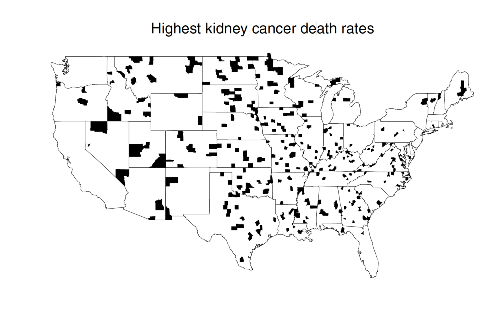

```{r setup, include = FALSE}
knitr::opts_chunk$set(echo = FALSE, eval = FALSE, fig.align = "center", 
                      message = FALSE, warning = FALSE)
library(tidyverse)
library(knitr)
library(here)
```


## Exercises from the book

**7.5**: 5, 8, 11, 12

**7.6**: 3, 12, 14, 23

\newpage

## Case Study: Bayes vs. Frequentist Estimators

The map below identifies the counties in the US with the highest kidney cancer rates in the US from 1980 - 1989.

```{r eval = TRUE, out.width="400px", fig.align = "center"}

```

As we discussed in class, it is difficult to identify a meaningful geographic pattern because many of these rates may have been caused by the high variability inherent in counties with very small populations. We will use simulation to evaluate how the picture would change if we were to use a Bayes Estimator.

### Formulating a prior

A Bayes Estimator requires that we specify a loss function and a prior/posterior. For the loss function, we'll use the standard squared loss. The prior is open to more debate, but a sensible place to start would be to coalate all of the information that we have about the variability in cancer rates across counties in the US. Recent data and expertise suggest that cancer rates average around and have a distribution well-described by the Gamma distribution.

```{r eval = TRUE}
# Downloaded from https://www.statecancerprofiles.cancer.gov/ on 2/8/20
incd <- read_csv(here("data", "incd.csv"), 
                 col_names = FALSE, 
                 skip = 9, 
                 na = c("", "NA", "*")) %>%
  select(1, 2, 4) %>%
  slice(2:3142)
names(incd) <- c("county", "fips", "cancer_incd")
incd <- incd %>%
  mutate(county = tolower(county) %>%
           str_replace(pattern = "\\(.*\\)",
                       replacement = "")) %>%
  separate(county, into = c("county", "state"), sep = ", ") %>%
  mutate(county = str_replace(county,
                              pattern = " county",
                              replacement = ""),
         cancer_rate = cancer_incd/100000) %>%
  drop_na(cancer_rate)
x <- incd$cancer_incd
n <- length(x)
alpha <- (n * sum(x))/(n * sum(x * log(x)) - sum(log(x)) * sum(x))
beta <- n^2/(n * sum(x * log(x)) - sum(log(x)) * sum(x))
```

Let $\theta_i$ be the cancer rate in county $i$ (cases per 100,000). $\theta_i \sim \textrm{Gamma}(\alpha = 17.87, \beta = .7144)$.

```{r, fig.height = 2, fig.width = 6, eval = TRUE}
ggplot(data.frame(x = 0), aes(x = x)) +
  stat_function(fun = dgamma, 
                args = list(shape = alpha, rate = beta), 
                n = 400) +
  xlim(0, 60) +
  theme_bw() +
  labs(x = expression(theta)) +
  theme(axis.title.y = element_blank(),
        axis.text.y = element_blank(),
        axis.ticks.y = element_blank(),
        panel.grid.major.y = element_blank())
```

Let's start out simulation by assuming that each county has a cancer rate drawn at random from this prior distribution. We can append those rates to a dataframe of county population from the `usmap` package (consult the Rmd for this assignment to harvest this code) and print out the first 10 counties.

```{r results = "asis", eval = TRUE}
set.seed(847)
library(usmap)
data(countypop)
countypop <- countypop %>%
  mutate(true_rate = rgamma(n(), alpha, beta))
  
library(xtable)
print(xtable(slice(countypop, 1:10)), comment = FALSE)
```

Even though these are simulated, let's think of them as the true cancer rates of these counties.

**Exercise 1:** Construct a plot that shows the relationship between the size of the population in a county and the corresponding cancer rate. You may need to use transformations of the scales so that the visualization is informative. How would you describe the relationship between these two variables?


### A model for the data

The number of cases, $X_i$, that actually materialize in county $i$ could be sensibly modeled using the Poisson distribution, $X_i \sim \textrm{Poisson}(n_i \times \theta_i / 100{,}000)$, where $n$ is the population of county $i$.

**Exercise 2:** For each county in `countypop`, use the Poisson distribution to simulate the number of cases according to that county's underlying rate. Add these counts as a new column in the dataframe called `n_cases`.

**Exercise 3:** Construct a county map of the US that shades in red the counties that rank in the top 10% in terms of number of cases (there is code in the Rmd that you are encouraged to utilize). Describe the pattern that emerges and propose an explanation for this structure.

```{r}
library(maps)
county_shapes <- map_data("county")
state_df <- tibble(abbr = state.abb,
                   region = tolower(state.name))
map_df <- countypop %>%
  mutate(county = tolower(county) %>%
           str_replace(pattern = " county",
                       replacement = "")) %>%
  left_join(state_df, by = "abbr") %>%
  left_join(county_shapes, by = c("region" = "region", "county" = "subregion"))

# A map of the smallest 1% of US counties by population
map_df <- map_df %>%
  mutate(small_counties = pop_2015 < quantile(pop_2015, .01))
ggplot() +
  geom_polygon(data = map_df, 
               aes(x = long,
                   y = lat, 
                   group = group,
                   fill = small_counties)) +
  scale_fill_manual(values = c("gray", "tomato")) +
  theme_minimal() +
  theme(legend.position = "none") +
  labs(x = "", y = "", title = "my title")
# If anyone can track down the bug that's leaving some counties (and LA) blank, please chime in over skype. It's likely in the join step.
```


### Estimating $\theta_i$

It is clear that better than simply visualizing the raw number of cases would be to estimate each county's underlying rate (per 100,000 people).

**Exercise 4**: For each county, come up with the maximum likelihood estimate of $\theta_i$. Note that for each county, we only observe a single observation. First lay out the general form of the MLE in this setting, then compute it for each county and add these estimates as a new column in `countypop`.

**Exercise 5**: As an alternative, lay out the general form of the Bayes Estimator using the squared loss and the Gamma prior outlined above. Then compute this estimate for each county and add it as a column to `countypop`. Using `xtable()` as we did above, print out this final table with both columns of estimates.

**Exercise 6**: What is the relationship between each of these estimates and the population size of each county? Construct two scatterplots side by side (see code for example), with population size on the axis on both and each of the estimates of the y-axes. Again, be sure to transform the scales to better reveal the structure. Describe the trend that you see in each plot.

```{r}
p1 <- ggplot(mtcars, aes(x = disp, y = hp)) +
  geom_point()
p2 <- ggplot(mtcars, aes(x = disp, y = mpg)) +
  geom_point()

library(patchwork)
p1 + p2
```

**Exercise 7**: Remake the US map two ways: one plotting the MLE and the other with the Bayes Estimator. What do you think is the cause of the dominant spatial pattern in the former? What about for the latter?


