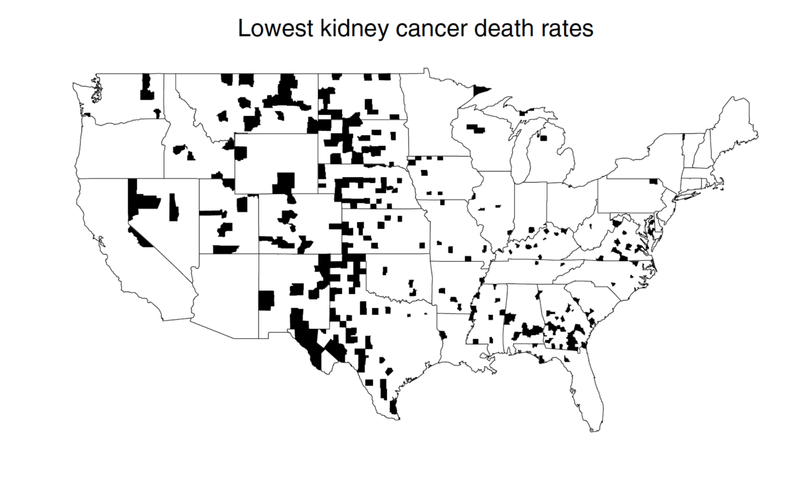

```{r, echo=FALSE, message=FALSE, warning=FALSE}
knitr::opts_chunk$set(message = FALSE, fig.align = "center", 
                      warning = FALSE, fig.height = 5.5)
library(dplyr)
library(readr)
library(ggplot2)
library(knitr)
```

# The Beta-binomial

---
# No data
--

```{r echo = FALSE}
# Function by Rasmus Baath
# This function takes a number of successes and failuers coded as a TRUE/FALSE
# or 0/1 vector. This should be given as the data argument.
# The result is a visualization of the how a Beta-Binomial
# model gradualy learns the underlying proportion of successes 
# using this data. The function also returns a sample from the
# posterior distribution that can be further manipulated and inspected.
# The default prior is a Beta(1,1) distribution, but this can be set using the
# prior_prop argument.

# Make sure the packages tidyverse and ggridges are installed, otherwise run:
# install.packages(c("tidyverse", "ggridges"))

# Example usage:
# data <- c(TRUE, FALSE, TRUE, TRUE, FALSE, TRUE, TRUE)
# prop_model(data)
prop_model <- function(data = c(), prior_prop = c(1, 1), n_draws = 10000) {
  library(tidyverse)
  data <- as.logical(data)
  # data_indices decides what densities to plot between the prior and the posterior
  # For 20 datapoints and less we're plotting all of them.
  data_indices <- round(seq(0, length(data), length.out = min(length(data) + 1, 20)))

  # dens_curves will be a data frame with the x & y coordinates for the 
  # denities to plot where x = proportion_success and y = probability
  proportion_success <- c(0, seq(0, 1, length.out = 100), 1)
  dens_curves <- map_dfr(data_indices, function(i) {
    value <- ifelse(i == 0, "Prior", ifelse(data[i], "Success", "Failure"))
    label <- paste0("n=", i)
    probability <- dbeta(proportion_success,
                         prior_prop[1] + sum(data[seq_len(i)]),
                         prior_prop[2] + sum(!data[seq_len(i)]))
    probability <- probability / max(probability)
    data_frame(value, label, proportion_success, probability)
  })
  # Turning label and value into factors with the right ordering for the plot
  dens_curves$label <- fct_rev(factor(dens_curves$label, levels =  paste0("n=", data_indices )))
  dens_curves$value <- factor(dens_curves$value, levels = c("Prior", "Success", "Failure"))

  p <- ggplot(dens_curves, aes(x = proportion_success, y = label,
                               height = probability, fill = value)) +
    ggridges::geom_density_ridges(stat="identity", color = "white", alpha = 0.8,
                                  panel_scaling = TRUE, size = 1) +
    scale_y_discrete("", expand = c(0.01, 0)) +
    scale_x_continuous("Underlying proportion of success") +
    scale_fill_manual(values = hcl(120 * 2:0 + 15, 100, 65), name = "", drop = FALSE,
                      labels =  c("Prior   ", "Success   ", "Failure   ")) +
    ggtitle(paste0(
      "Binomial model - Data: ", sum(data),  " successes, " , sum(!data), " failures")) +
    theme_light() +
    theme(legend.position = "top")
  print(p)

  # Returning a sample from the posterior distribution that can be further 
  # manipulated and inspected
  posterior_sample <- rbeta(n_draws, prior_prop[1] + sum(data), prior_prop[2] + sum(!data))
  invisible(posterior_sample)
}
```

```{r p0, eval = FALSE}
prop_model()
```

```{r ref.label = "p0", echo = FALSE}
prop_model()
```


---
# One observation

```{r p1, eval = FALSE}
data <- c(FALSE)
prop_model(data)
```

--

```{r ref.label = "p1", echo = FALSE}
data <- c(FALSE)
prop_model(data)
```

---
# Three observations

```{r p2, eval = FALSE}
data <- c(FALSE, TRUE, FALSE)
prop_model(data)
```

--

```{r ref.label = "p2", echo = FALSE}
data <- c(FALSE, TRUE, FALSE)
prop_model(data)
```

---
# Three observations, reordered

```{r p3, eval = FALSE}
data <- c(TRUE, FALSE, FALSE)
prop_model(data)
```

--

```{r ref.label = "p3", echo = FALSE}
data <- c(TRUE, FALSE, FALSE)
prop_model(data)
```

---
# Sequential observations
--

There are two ways of thinking about updating a prior:

1. In one lump, based on the full dataset $\mathbf{x}$.
2. As a sequence of $n$ individual updates to the prior.

--

*The posterior will be the same by both methods.*


---
# 100 observations

```{r echo = FALSE}
set.seed(40)
```

```{r p4, eval = FALSE}
big_data <- sample(c(TRUE, FALSE), prob = c(0.75, 0.25),
                   size = 100, replace = TRUE)
prop_model(big_data)
```

--

```{r ref.label = "p4", echo = FALSE, fig.height = 5}
big_data <- sample(c(TRUE, FALSE), prob = c(0.75, 0.25),
                   size = 100, replace = TRUE)
prop_model(big_data)
```

--

More data leads to less uncertainty around the parameter.

---
# A strong positive prior

```{r echo = FALSE}
set.seed(40)
```

```{r p5, eval = FALSE}
big_data <- sample(c(TRUE, FALSE), prob = c(0.75, 0.25),
                   size = 100, replace = TRUE)
prop_model(big_data, prior_prop = c(5, 1))
```

--

```{r ref.label = "p5", echo = FALSE, fig.height = 5}
big_data <- sample(c(TRUE, FALSE), prob = c(0.75, 0.25),
                   size = 100, replace = TRUE)
prop_model(big_data, prior_prop = c(5, 1))
```


---
# A strong negative prior

```{r echo = FALSE}
set.seed(40)
```

```{r p6, eval = FALSE}
big_data <- sample(c(TRUE, FALSE), prob = c(0.75, 0.25),
                   size = 100, replace = TRUE)
prop_model(big_data, prior_prop = c(1, 5))
```

--

```{r ref.label = "p6", echo = FALSE, fig.height = 5}
big_data <- sample(c(TRUE, FALSE), prob = c(0.75, 0.25),
                   size = 100, replace = TRUE)
prop_model(big_data, prior_prop = c(1, 5))
```


---
# Back to three observations

```{r p7, eval = FALSE}
data <- c(FALSE, TRUE, FALSE)
prop_model(data)
```

--

```{r ref.label = "p7", echo = FALSE}
data <- c(FALSE, TRUE, FALSE)
prop_model(data)
```


---
# n = 3 with strong prior

```{r p8, eval = FALSE}
data <- c(FALSE, TRUE, FALSE)
prop_model(data, prior_prop = c(1, 5))
```

--

```{r ref.label = "p8", echo = FALSE}
data <- c(FALSE, TRUE, FALSE)
prop_model(data, prior_prop = c(1, 5))
```

---
# What is the explanation for this pattern?
--

```{r echo = FALSE}
include_graphics("figs/kidney-high.png")
```


---
# What is the explanation for this pattern?
--

```{r echo = FALSE}

```

