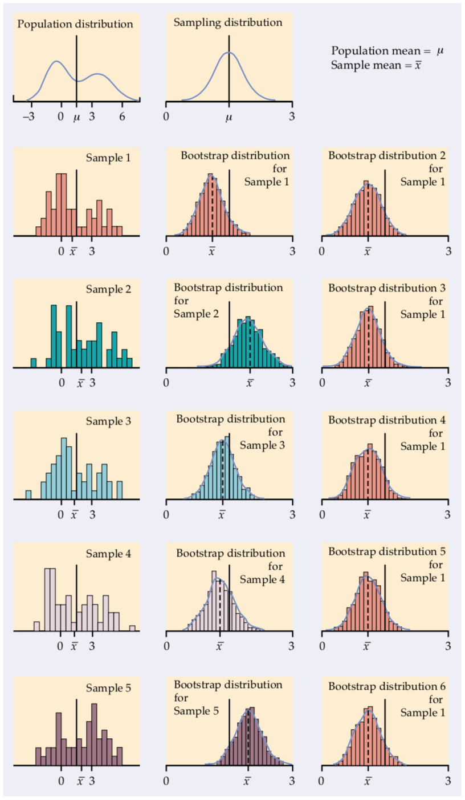
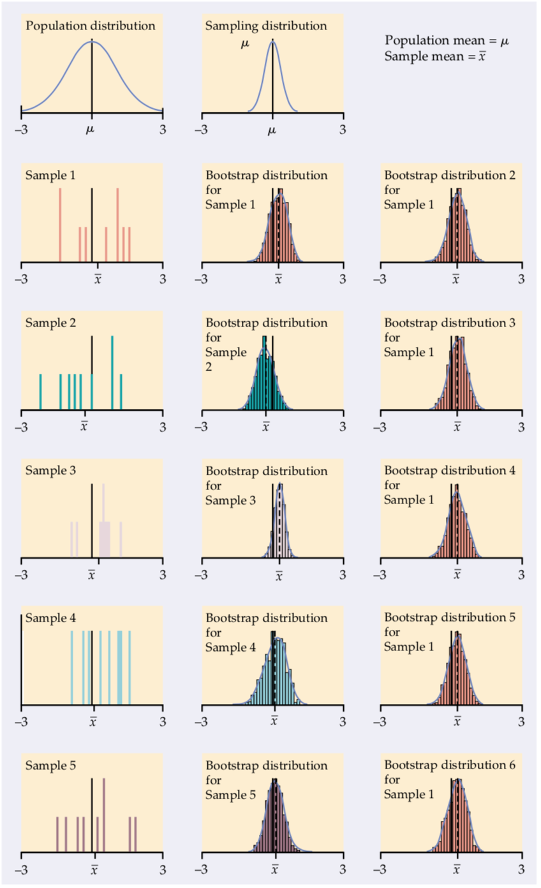

```{r, echo=FALSE, message=FALSE, warning=FALSE}
knitr::opts_chunk$set(message = FALSE, fig.align = "center", 
                      warning = FALSE, fig.height = 5.5)
library(tidyverse)
```

# The Bootstrap Distribution

The bootstrap distribution of a statistic is an approximation to the sampling distribution of that statistic.


---
# Sampling Distribution of $X_{max}$
--

Let $X_1, X_2, \ldots X_n\sim \textrm{Unif}(0, \theta)$. We estimate the parameter using $\hat{\theta}_{MLE} = \textrm{max}(X_1, X_2, \ldots X_n)$. 

We can approximate the sampling distribution using simulation.
--

```{r}
set.seed(501)
n <- 30
theta <- 250
it <- 50000
mles <- rep(NA, it)

for (i in 1:it) {
  x <- runif(n, 0, theta)
  mles[i] <- max(x)
}
```


---
# Sampling Distribution of $X_{max}$, cont.
--

```{r echo = FALSE}
data.frame(mles) %>%
  ggplot(aes(x = mles)) +
  geom_density() +
  theme_bw()
```


---
# Bootstrapping $X$
--

A single bootstrap sample $X*$ is a sample of size $n$ drawn from $X$ with replacement.

```{r}
x <- runif(n, 0, theta)
x_boot <- sample(x, size = n, replace = TRUE)
```

--

```{r}
x_boot
```

--

```{r}
x
```


---
# Bootstrapping $X$, cont.
--

```{r echo = FALSE, fig.height = 3}
data.frame(x_boot) %>%
  ggplot(aes(x = x_boot)) +
  geom_dotplot()
```

--

```{r echo = FALSE, fig.height = 3}
data.frame(x) %>%
  ggplot(aes(x = x)) +
  geom_dotplot()
```

---
# Bootstrapping $X_{max}$
--

```{r}
B <- 50000
mles_boot <- rep(NA, B)
for (i in 1:B) {
  x_boot <- sample(x, size = n, replace = TRUE)
  mles_boot[i] <- max(x_boot)
}
```


---
# Bootstrap Distribution of $X_{max}$
--

```{r echo=FALSE}
data.frame(mles_boot) %>%
  ggplot(aes(x = mles_boot)) +
  geom_density() +
  theme_bw()
```


---
# Bootstrap vs Sampling Dist.
--

```{r echo = FALSE, fig.height = 3}
p1 <- data.frame(mles) %>%
  ggplot(aes(x = mles)) +
  geom_density() +
  theme_bw()

p2 <- data.frame(mles_boot) %>%
  ggplot(aes(x = mles_boot)) +
  geom_density() +
  theme_bw()

library(patchwork)
p1 + p2
```


---
# Bootstrap vs Sampling Dist.
--

$n = 50$
$B = 1000$

```{r echo = FALSE, fig.height=2}

```


---
# Bootstrap vs Sampling Dist.
--

$n = 9$
$B = 1000$

```{r echo = FALSE}

```


---
# Using the Bootstrap
--

- Does not improve your estimate of the **center** of the sampling distribution.

--

- At reasonable n, can provide a useful estimate of the **spread** and **shape** of the distribution.

--

- Also useful for estimating the **bias**.


---
# Recall: Sampling Distribution of $X_{max}$
--

```{r echo = FALSE}
data.frame(mles) %>%
  ggplot(aes(x = mles)) +
  geom_density() +
  theme_bw()
```

--

```{r}
mean(mles) - theta
```


---
# Bootstrap Distribution of $X_{max}$
--

```{r echo=FALSE}
data.frame(mles_boot) %>%
  ggplot(aes(x = mles_boot)) +
  geom_density() +
  theme_bw()
```


--

```{r}
mean(mles_boot) - max(x)
```


---
# True Answer
--

```{r}
n/(n + 1) * theta - theta
```


---
# True Answer
--